CSE-AI student at IGDTUW. I build AI products end to end: multi-agent systems, on-device models, and the interfaces around them. Most of my effort goes into what happens after the demo works: latency, fallbacks, and whether the output is actually right.

[Portfolio](https://portfolio-akanshamishra.vercel.app/) · [LinkedIn](https://www.linkedin.com/in/akansha-mishra-082363199) · [Email](mailto:mishakansha.01@gmail.com)

## The big one

Read the Government of India [PIB press release](https://www.pib.gov.in/PressReleasePage.aspx?PRID=2310855&reg=48&lang=2) on the BHASHINI VYOMA winners.

## About me

I like starting from the problem: who is stuck, and why. Then I build far enough to find out whether the idea holds. My work spans computer vision, LLM and RAG systems, multi-agent pipelines, edge AI, and the full-stack code to ship them.

## My sketchbook

## What I know

| Area | In practice |
| --- | --- |
| Computer vision | CNN regression on medical imaging (TensorFlow, Keras) |
| LLM and multi-agent | Parallel agent orchestration, critic and fact-check steps, provider fallbacks |
| Retrieval and speech | Document-grounded answering, multilingual ASR (Whisper, IndicConformer), OCR |
| Edge AI | Fully offline inference on a Jetson Orin Nano Super with a 1.7B model |
| Full stack | React, React Native (Expo), FastAPI, Firebase |
| Languages | Python, JavaScript, C++ |

## Gold stars

- **Winner**, BHASHINI VYOMA Innovation Challenge 2026: one of 4 national winning teams from 10 finalists (Apna Saathi), with ₹10,00,000 in prize money, a ₹2,00,000 development grant and a [PIB press release](https://www.pib.gov.in/PressReleasePage.aspx?PRID=2310855&reg=48&lang=2)
- **Top 10 with special mention**, Paytm Build for AI 2026, Track 2: AI-Powered Financial Journeys (IntentShield)
- **Three hackathon wins in 2026**: MedTech AI Hackathon, Legacy and CodeRammers
- **1st runner-up**, Cross Time Conversations (AAROHAN 2026)
- **2nd place**, JAM Extempore (DU 2026)
- **Top 7 finalist**, TEDx IGDTUW 2026
- **Selected**, Spark Fellowship 2026 cohort
